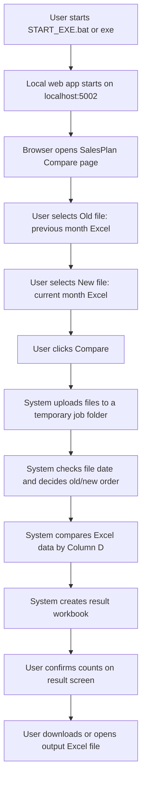
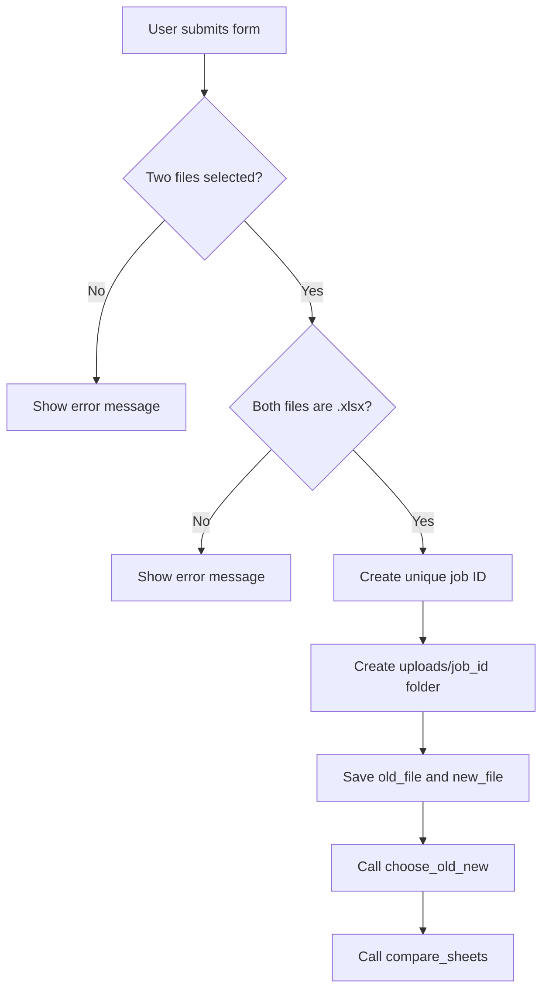
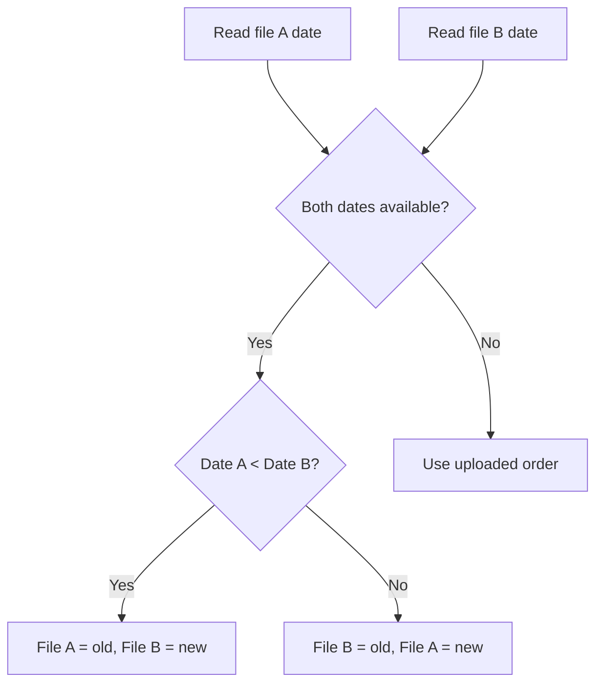
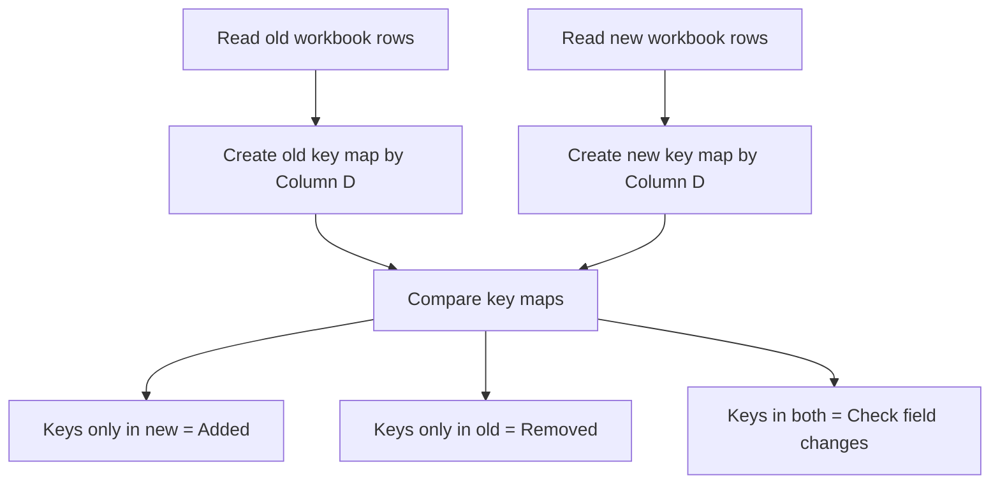
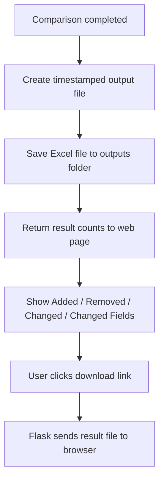

# Monthly Sales Plan Compare - Biz Flow

## 1. Purpose

This tool compares two monthly sales plan Excel files:

- Old file: previous month's monthly sales plan
- New file: current month's monthly sales plan

The tool uses the value in Column D as the matching key and identifies:

- Added records in the current month
- Removed records from the previous month
- Changed records and changed fields

The output is an Excel comparison file with color highlights and a Summary sheet.

## 2. User Flow



## 3. System Flow

### 3.1 Application Start

File: `app.py`

1. The Flask app starts on `127.0.0.1:5002`.
2. When running as an exe, the browser opens automatically.
3. Upload files are saved under `uploads`.
4. Result files are saved under the configured `outputs` folder.

Important note:

- `localhost` or `127.0.0.1` means the user's own PC.
- It is not a shared server IP.
- Each user must run the exe/bat on their own PC before opening `http://localhost:5002/`.

## 4. Upload Flow

File: `app.py`



Validation rules:

- Both files are required.
- Only `.xlsx` files are accepted.
- Temporary Excel files starting with `~$` are rejected.
- Maximum upload size is 80 MB.

## 5. Old/New Decision Flow

File: `compare_core.py`

Function: `choose_old_new(file_a, file_b)`



The file date is read from the workbook data near the top rows. If both dates are available, the earlier file is treated as the previous month file.

## 6. Excel Compare Logic

File: `compare_core.py`

Main function: `compare_sheets(old_file_path, new_file_path, output_dir)`

### 6.1 Workbook Handling

1. Open the new workbook with values only.
2. Open the new workbook again with styles.
3. Open the old workbook with values only.
4. Use the first sheet from the new workbook.
5. Use the matching sheet name from the old workbook if available.
6. If no matching sheet exists, use `Export` or the last sheet.

### 6.2 Output Sheet Structure

The output workbook is based on the current month workbook.

Created or renamed sheets:

- `Summary`: comparison dashboard and detail list
- `new data`: current month data with highlights
- `old data`: previous month data copied into the result workbook

## 7. Matching Logic

File: `compare_core.py`

Constants:

- Header row: row 1
- Data starts from: row 2
- Key column: Column D



Rows without a Column D value are ignored.

## 8. Difference Rules

### 8.1 Added Records

Condition:

- Column D key exists in the new file but does not exist in the old file.

Action:

- Highlight the whole row in yellow in `new data`.
- Add the record to the Summary detail table as `Added`.

### 8.2 Removed Records

Condition:

- Column D key exists in the old file but does not exist in the new file.

Action:

- Highlight the whole row in gray in `old data`.
- Add the record to the Summary detail table as `Removed`.

### 8.3 Changed Records

Condition:

- Column D key exists in both files, but one or more field values are different.

Action:

- Highlight changed cells in orange in `new data`.
- Add each changed field to the Summary detail table as `Changed`.

Comparison behavior:

- Blank values are treated as empty strings.
- Text values are trimmed before comparison.
- Numeric values are compared as numbers when possible.

### 8.4 New Columns

Condition:

- A column header exists in the new file but does not exist in the old file.

Action:

- Highlight the new column header in green.

## 9. Summary Sheet Output

File: `compare_core.py`

Function: `write_summary(...)`

The Summary sheet includes:

- Previous Period Total
- Additions
- Deletions
- Current Period Total
- Modified Rows
- Modified Fields
- Detail table for Added / Removed / Changed items
- Color legend

Detail table columns include:

- Type
- Line No
- Context fields from selected columns
- Field
- Old Value
- New Value

## 10. Color Meaning

| Color | Meaning |
|---|---|
| Yellow | Added record |
| Gray | Removed record |
| Orange | Changed value |
| Green | New column in current month file |

## 11. Output Flow



Output filename format:

```text
<new_file_name>_Compared_<YYYYMMDD_HHMM>.xlsx
```

## 12. User Result Confirmation

After comparison, the user checks:

1. Added record count
2. Removed record count
3. Changed record count
4. Changed field count
5. Output file path
6. Download button
7. Summary sheet inside the Excel result file
8. Color-highlighted `new data` and `old data` sheets

## 13. Deployment / Usage Note

This tool is currently designed as a local web application.

Typical usage:

1. User opens shared folder.
2. User runs `START_EXE.bat` or the exe file.
3. The local app starts on the user's own PC.
4. Browser opens `http://localhost:5002/`.
5. User uploads Excel files and runs the comparison.

Important:

- `localhost` is not a company server address.
- One user's `localhost` cannot be opened from another user's PC.
- If multiple users need to use the tool, each user should run the exe/bat locally from the shared folder.

## 14. Main Files

| File | Role |
|---|---|
| `app.py` | Flask web app, upload/download routing, browser startup |
| `compare_core.py` | Excel comparison logic and output workbook generation |
| `templates/index.html` | Web UI |
| `START_EXE.bat` | Startup helper for users |
| `MonthlySalesPlanCompareExe.exe` | Packaged executable version |
| `outputs` | Result Excel output folder |
| `uploads` | Temporary uploaded files |

