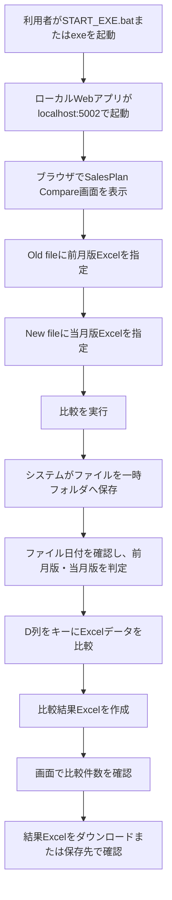
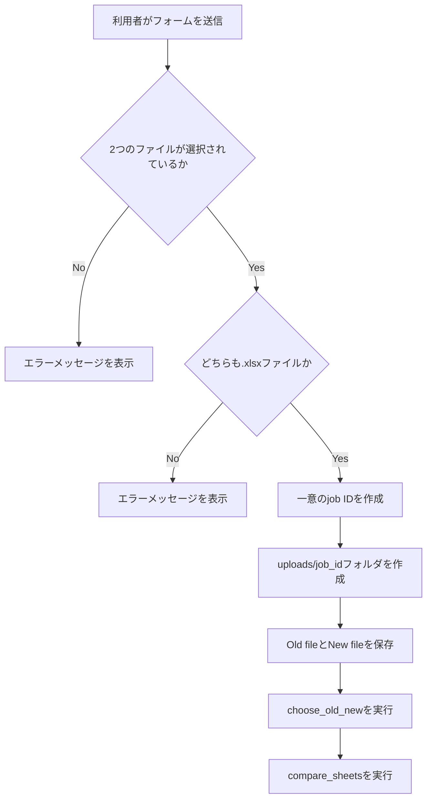
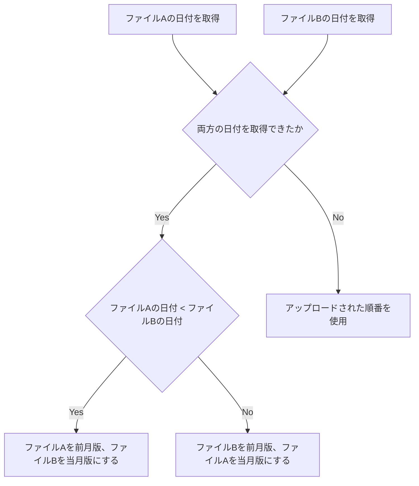
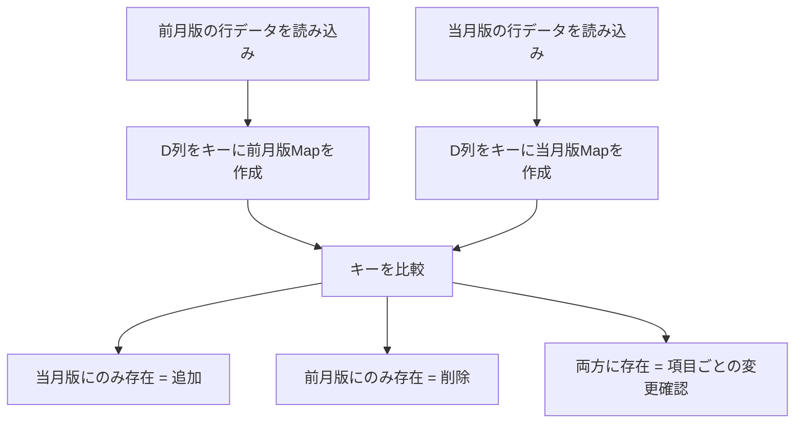
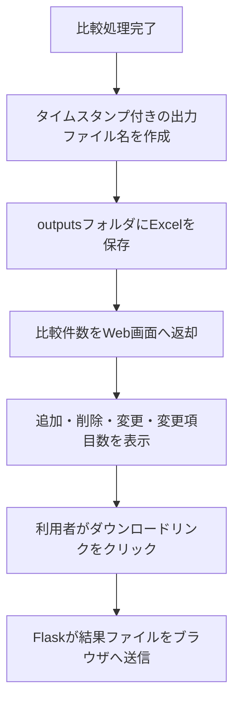

# 月次販売計画 比較ツール - 業務フロー

## 1. 目的

本ツールは、月次販売計画のExcelファイルについて、前月版と当月版を比較し、変更点を確認するためのツールです。

比較対象：

- Old file：前月の月次販売計画
- New file：当月の月次販売計画

D列の値をキーとして照合し、以下を抽出します。

- 当月版で追加されたレコード
- 前月版から削除されたレコード
- 内容が変更されたレコードおよび項目

比較結果は、色分けされたExcelファイルとSummaryシートとして出力されます。

## 2. 利用者の操作フロー



## 3. システム起動フロー

対象ファイル：`app.py`

1. Flaskアプリを `127.0.0.1:5002` で起動します。
2. exeとして実行している場合、ブラウザを自動で開きます。
3. アップロードされたファイルは `uploads` に保存します。
4. 比較結果ファイルは設定された `outputs` フォルダに保存します。

重要事項：

- `localhost` または `127.0.0.1` は、利用者自身のPCを指します。
- 共有サーバーのIPアドレスではありません。
- 他の人のPCから、自分のPCの `localhost:5002` を開くことはできません。
- 利用者ごとに、自分のPC上でexeまたはbatを起動する必要があります。

## 4. アップロード処理フロー

対象ファイル：`app.py`



入力チェック：

- 2つのファイルが必須です。
- `.xlsx` ファイルのみ利用できます。
- `~$` から始まるExcel一時ファイルは対象外です。
- アップロード上限は80MBです。

## 5. 前月版・当月版の判定

対象ファイル：`compare_core.py`

関数：`choose_old_new(file_a, file_b)`



ファイル内の日付が取得できる場合、日付が古い方を前月版、新しい方を当月版として扱います。

## 6. Excel比較処理

対象ファイル：`compare_core.py`

メイン関数：`compare_sheets(old_file_path, new_file_path, output_dir)`

### 6.1 Workbookの読み込み

1. 当月版Workbookを値取得用として開きます。
2. 当月版Workbookをスタイル保持用として再度開きます。
3. 前月版Workbookを値取得用として開きます。
4. 当月版は先頭シートを使用します。
5. 前月版に同じシート名があれば、そのシートを使用します。
6. 同じシート名がない場合は、`Export` シートまたは最後のシートを使用します。

### 6.2 出力Workbookの構成

出力Workbookは当月版Workbookをベースに作成します。

作成・リネームされるシート：

- `Summary`：比較結果のサマリーと詳細一覧
- `new data`：当月版データ。追加・変更箇所を色分け
- `old data`：前月版データ。削除レコードを色分け

## 7. 照合ロジック

対象ファイル：`compare_core.py`

定数：

- ヘッダー行：1行目
- データ開始行：2行目
- キー列：D列



D列が空白の行は、比較対象外です。

## 8. 差分判定ルール

### 8.1 追加レコード

条件：

- D列のキーが当月版に存在し、前月版には存在しない。

処理：

- `new data` シートの該当行を黄色でハイライトします。
- Summaryの詳細一覧に `Added` として出力します。

### 8.2 削除レコード

条件：

- D列のキーが前月版に存在し、当月版には存在しない。

処理：

- `old data` シートの該当行をグレーでハイライトします。
- Summaryの詳細一覧に `Removed` として出力します。

### 8.3 変更レコード

条件：

- D列のキーが前月版・当月版の両方に存在し、いずれかの項目値が異なる。

処理：

- `new data` シートの変更セルをオレンジでハイライトします。
- Summaryの詳細一覧に `Changed` として、変更項目ごとに出力します。

比較時の扱い：

- 空白は空文字として扱います。
- 文字列は前後の空白を除いて比較します。
- 数値として比較できる場合は、数値として比較します。

### 8.4 新規列

条件：

- 当月版に存在する列見出しが、前月版には存在しない。

処理：

- `new data` シートの該当列見出しを緑でハイライトします。

## 9. Summaryシート

対象ファイル：`compare_core.py`

関数：`write_summary(...)`

Summaryシートには以下を出力します。

- 前月版の総件数
- 追加件数
- 削除件数
- 当月版の総件数
- 変更レコード数
- 変更項目数
- 追加・削除・変更の詳細一覧
- 色分けの凡例

詳細一覧の主な列：

- Type
- Line No
- 参照用の周辺項目
- Field
- Old Value
- New Value

## 10. 色分けルール

| 色 | 意味 |
|---|---|
| 黄色 | 追加レコード |
| グレー | 削除レコード |
| オレンジ | 変更された値 |
| 緑 | 当月版で追加された列 |

## 11. 出力処理フロー



出力ファイル名：

```text
<当月版ファイル名>_Compared_<YYYYMMDD_HHMM>.xlsx
```

## 12. 利用者が確認する内容

比較後、利用者は以下を確認します。

1. 追加record数
2. 削除record数
3. 変更record数
4. 変更項目数
5. 出力ファイルの保存先
6. ダウンロードボタン
7. 結果ExcelのSummaryシート
8. `new data` と `old data` の色分け箇所

## 13. 配布・利用時の注意

本ツールは、ローカルWebアプリとして動作します。

通常の利用手順：

1. 利用者が共有フォルダを開きます。
2. `START_EXE.bat` またはexeファイルを実行します。
3. 利用者自身のPC上でWebアプリが起動します。
4. ブラウザで `http://localhost:5002/` を開きます。
5. Excelファイルをアップロードして比較します。

注意：

- `localhost` は共有サーバーではありません。
- 他の利用者の `localhost` を自分のPCから開くことはできません。
- 複数人で利用する場合は、各利用者が自分のPCでexeまたはbatを実行します。

## 14. 主要ファイル

| ファイル | 役割 |
|---|---|
| `app.py` | Flask Webアプリ、アップロード・ダウンロード処理、ブラウザ起動 |
| `compare_core.py` | Excel比較ロジック、結果Workbook作成 |
| `templates/index.html` | Web画面 |
| `START_EXE.bat` | 利用者向け起動用bat |
| `MonthlySalesPlanCompareExe.exe` | exe化された実行ファイル |
| `outputs` | 比較結果Excelの保存先 |
| `uploads` | アップロードファイルの一時保存先 |

